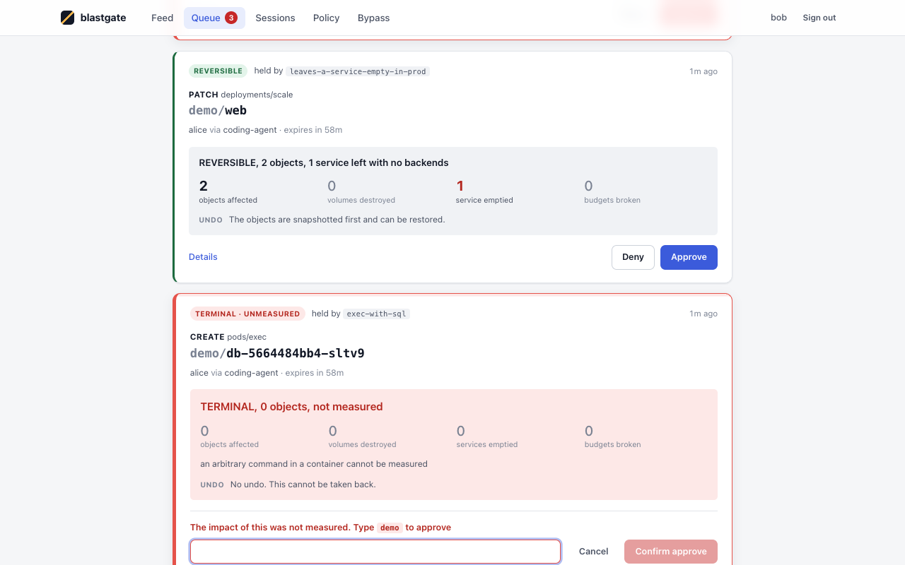
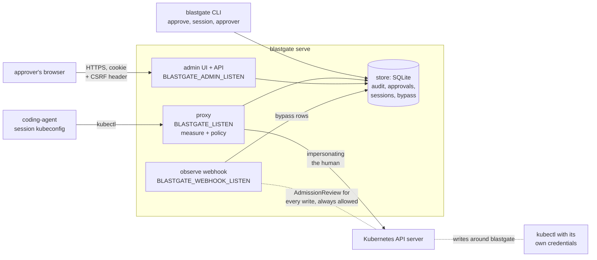
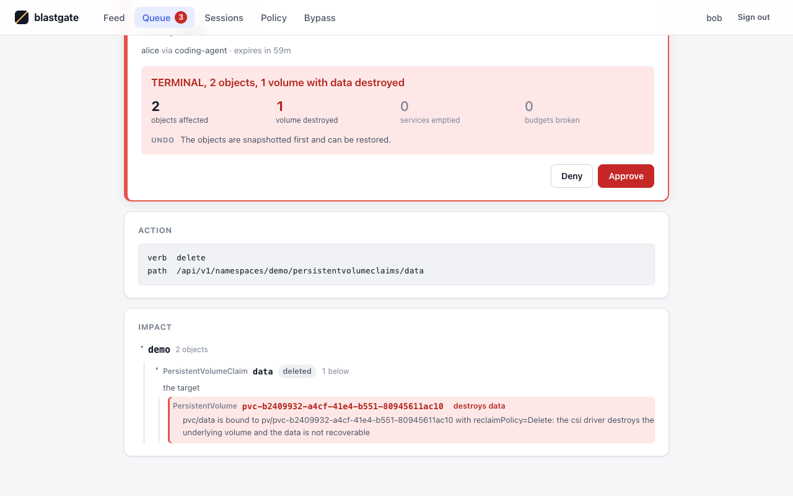
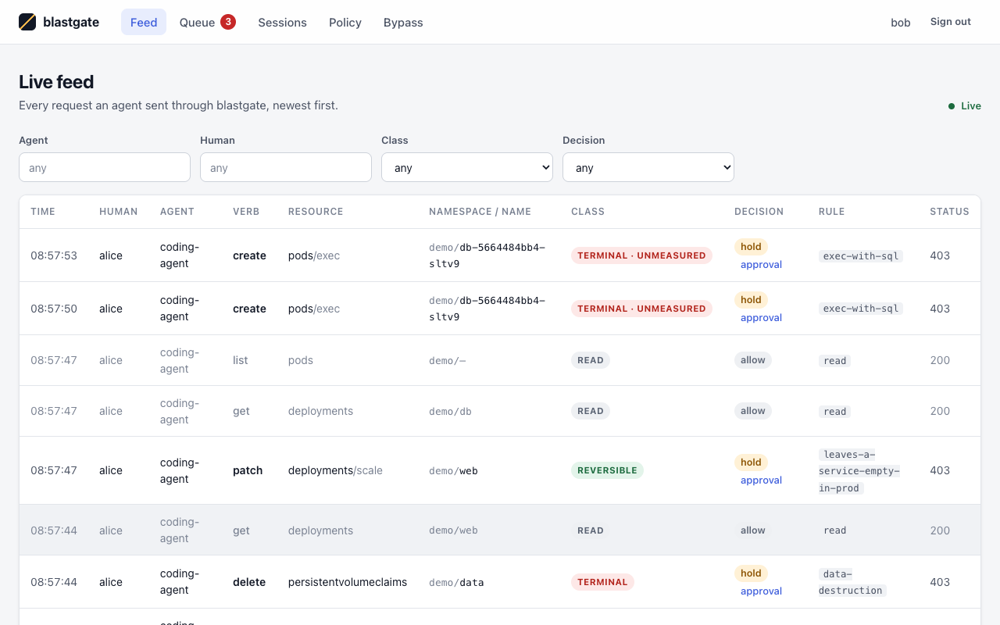
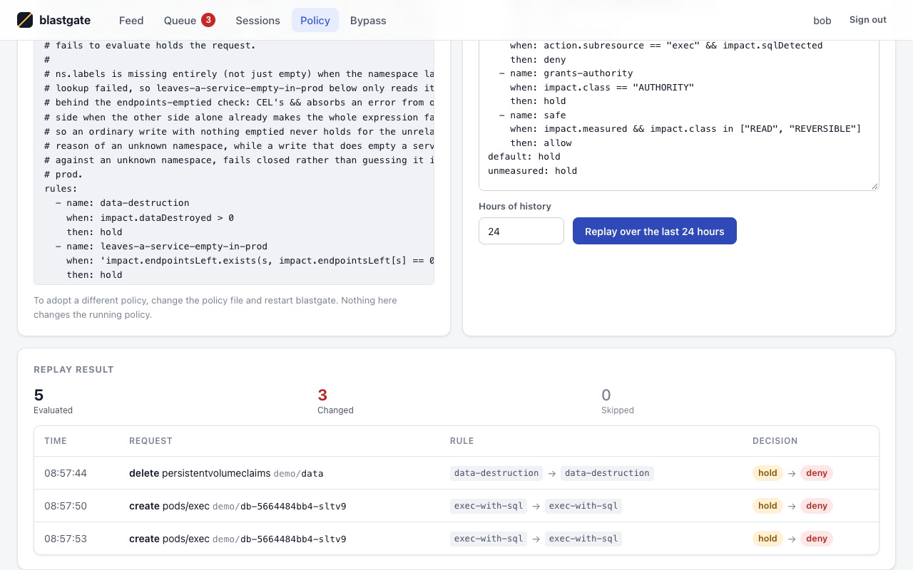
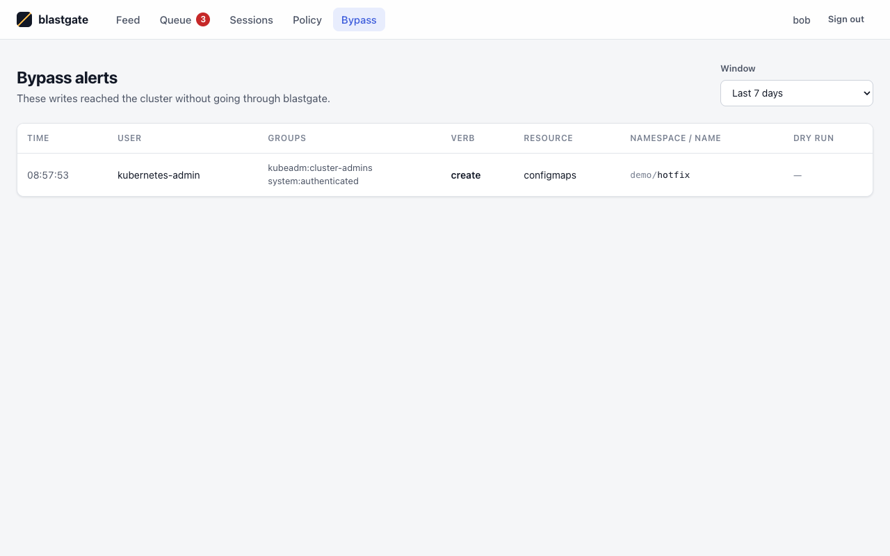

# blastgate



A gateway between AI agents and Kubernetes. An agent's kubectl talks to blastgate,
and blastgate forwards each request **as the human who owns the agent's session**,
using Kubernetes impersonation — so the cluster's own RBAC decides what the agent
may do, and the cluster's own audit log records a person, an agent and a session
instead of a shared admin credential.

Every write is measured before it reaches the cluster — what it would delete,
which Services it would leave without backends, whether it destroys data — and put
to a policy that allows it, refuses it, or holds it until a person approves. What
cannot be measured is held.

Held requests wait in a queue that a person decides from the web UI or the CLI, and an
observe-only admission webhook records writes that reached the cluster without going
through blastgate at all.

## How it fits together



The agent talks only to the proxy, which measures, decides and forwards. The admin
listener serves the web UI and its JSON API to approvers, and the webhook listener,
off by default, is called by the API server for every write so that writes made around
blastgate leave a record. All three are separate listeners and share one store.

## Try it

Two shells, ideally as two OS users: one runs blastgate and holds its secrets, the
other is the agent's and holds nothing but a session kubeconfig.

```sh
# Shell 1 -- blastgate's user. The signing key and data directory stay here.
export BLASTGATE_DATA_DIR=~/.blastgate
export BLASTGATE_SIGNING_KEY=$(openssl rand -hex 32)
export BLASTGATE_UPSTREAM_KUBECONFIG=./blastgate-sa.kubeconfig   # see below
# The kubeconfig holds the session token: hand it to the agent and no one else.
(umask 077; blastgate session new --human alice@example.com --agent coding-agent --ttl 8h > agent.kubeconfig)
blastgate serve
```

```sh
# Shell 2 -- the agent's user. Only the session kubeconfig, copied over.
export KUBECONFIG=agent.kubeconfig
kubectl get pods              # reads pass straight through
kubectl delete pvc data       # destroys a volume's data: held
# Error from server (Forbidden): blastgate: held for approval 3f9c… (rule data-destruction:
#   TERMINAL, 2 objects, 1 volume with data destroyed). Ask a person to approve it with
#   `blastgate approve 3f9c… --by <name>`, then retry.
```

```sh
# Shell 3 -- a person, as blastgate's user (same data directory and signing key).
blastgate approvals --status pending
blastgate approve 3f9c… --by bob
```

Or approve it in the browser: see [Using the web UI](#using-the-web-ui).

```sh
# Shell 2 again
kubectl delete pvc data       # the retry is re-measured, then forwarded
```

Whichever command runs first creates the data directory, its database and a local CA
that every session kubeconfig embeds. Both are safe to start together, but minting the
session first means `serve` finds everything already in place. If blastgate listens on every address
(`BLASTGATE_LISTEN=0.0.0.0:8443`), `session new` needs `--server` with the address
kubectl should dial.

`BLASTGATE_SIGNING_KEY` signs approval tokens: `serve` and `approve`/`deny` must
share it (and the data directory).

**Keep the agent out of blastgate's trust.** Anyone holding the signing key and the data
directory can approve anything. Run `serve`, `approve` and `deny` as a different OS
user from the agent; never put `BLASTGATE_SIGNING_KEY`, the data directory or the
upstream kubeconfig in the agent's environment or anywhere it can read. The agent gets
its session kubeconfig and nothing else. The ticket it receives asks for a person for
this reason: an agent that could run `blastgate approve` itself would be approving its
own writes.

| Variable | Default | |
|---|---|---|
| `BLASTGATE_HOLD` | `45s` | how long a held request waits for a decision before its ticket is returned; at most `50s`, because kubectl gives up after 60s |
| `BLASTGATE_SCORE_BUDGET` | `5s` | how long measuring one write may take; hold plus **twice** the budget at most `55s` (a held request's retry is re-scored, and its snapshot is bounded by the same budget) |
| `BLASTGATE_APPROVAL_TTL` | `15m` | how long an approval stays spendable |
| `BLASTGATE_POLICY` | built in | a policy file (see [Policy](#policy)) |
| `BLASTGATE_LISTEN` | `127.0.0.1:8443` | the proxy the agent's kubectl talks to |
| `BLASTGATE_ADMIN_LISTEN` | `127.0.0.1:8444` | the web UI and its API (see [Admin security](#admin-security)) |
| `BLASTGATE_WEBHOOK_LISTEN` | unset: off | the observe webhook (see [Writes that go around blastgate](#writes-that-go-around-blastgate)) |
| `BLASTGATE_WEBHOOK_CLIENT_CA` | unset | a PEM file of CAs; when set, the webhook requires a client certificate signed by one of them. Refused without `BLASTGATE_WEBHOOK_LISTEN` |
| `BLASTGATE_BYPASS_IGNORE` | `system:node:,system:kube-,system:serviceaccount:kube-system:,system:apiserver` | username prefixes the webhook never records; a value replaces the default list, it does not add to it |
| `BLASTGATE_BYPASS_INCLUDE_NOISE` | unset | `1` makes the webhook record Lease and Event writes too, which it skips by default; anything but `0` or `1` is refused |
| `BLASTGATE_ALLOW_REMOTE` | unset | `1` lets any of the three listeners bind a non-loopback address; without it `serve` refuses to start |
| `BLASTGATE_TLS_HOSTS` | `127.0.0.1,localhost` | the names and addresses the serving certificate covers, for all three listeners |

## Service account

The upstream kubeconfig is blastgate's own service account. It needs `impersonate` on
`users` and on `userextras/blastgate-agent` and `userextras/blastgate-session`, and
`get`, `list`, `watch` on everything — scoring reads the objects an action would
affect. That includes Secrets: enumerating what a namespace delete takes with it lists
them. It has **no write verb**: every write, and every dry-run and "before" read made
while scoring, is sent impersonated as the session's human, so it carries exactly
their rights and their admission. See `fixture/manifests/01-blastgate.yaml`.
blastgate never reads your default kubeconfig.

## How a request is decided

- **Reads** (`get`, `list`, `watch`, logs) are forwarded at once and audited. They are
  never measured or held. A request that upgrades its connection (`Connection: Upgrade`)
  is never a read, whatever its verb or subresource: it opens a stream (a VM console,
  say) and is measured, or held unmeasured, like a write. A path with a `.`, `..` or
  empty segment is refused, since a server that cleans paths would resolve it to a
  different object than the one decided on.
- **Writes** are measured first, within `BLASTGATE_SCORE_BUDGET`:
  - a **delete** (and an eviction) by [sounding](https://github.com/SaiPisey2/sounding),
    which walks what it would take with it: owned objects, volumes whose data goes, Services
    left without backends, disruption budgets broken;
  - a **create, update or patch** by the API server's own dry-run, sent as the human,
    compared with the live object: a scale-down is measured for the pods it removes, a
    relabel for the Services it orphans, a selector change for the pods it retargets;
  - an **RBAC write**, a service-account token or a CSR approval is `AUTHORITY`, without
    a dry-run;
  - `kubectl auth whoami` and `kubectl auth can-i` ask about the caller and store nothing,
    so they are measured as reads;
  - **exec, attach, port-forward and proxied requests are not measured**: what a shell
    does inside a container cannot be seen from outside it. The command line is checked for
    a database client or SQL, which the policy can name. exec, attach and port-forward are
    `create` whichever transport kubectl uses (WebSocket, or SPDY on fallback), as the API
    server itself authorises them, so one command is one approval;
  - **`kubectl debug`** (an update or patch of `pods/<x>/ephemeralcontainers`) starts a
    command of its choosing in the pod, so it is unmeasured like exec, with the same SQL
    check over the ephemeral containers' `command` and `args`.
- Creating a workload — a Pod, Job or Deployment — is measured as the object it creates,
  not as what its containers then run: the command in its spec runs unmeasured by
  blastgate. Hold or deny those creates in policy if that matters to you.
- An agent's own `--dry-run=server` write is scored like the real write and may be held:
  blastgate measures what the request would do, and does not special-case the agent's
  `dryRun`.
- The measurement has a class — `READ`, `REVERSIBLE`, `COMPENSABLE`, `TERMINAL` or
  `AUTHORITY` — and anything that could not be measured (an error, the budget running
  out, a dry-run refused for a reason the real request might not be) is `TERMINAL` and
  unmeasured.
- The **policy** then says `allow`, `hold` or `deny`.

A dry-run the API server refuses with 403 or 404 is scored as "the real request would be
refused too" (`READ`, `dryRunRejected`). Any other refusal — a webhook that does not
support dry-run, a conflict, a throttle — leaves the write unmeasured, and so held. An
admission webhook that deliberately denies dry-runs with 403 is therefore taken at its
word: the write is scored as refused, and forwarded to be refused (or not) for real.

## Holding and approving

A held request waits up to `BLASTGATE_HOLD` for a decision. Approved in that window,
the original request goes through and the agent never notices. Otherwise the agent
gets a `403` whose message is the ticket:

```
blastgate: held for approval 3f9c0e…(32 hex) (rule data-destruction: TERMINAL, 2 objects, 1 volume with data destroyed). Ask a person to approve it with `blastgate approve 3f9c0e… --by <name>`, then retry.
```

The ticket carries only what blastgate generated: the approval ID, the rule name, the
class and counts. Never object names or anything from the request — the agent can
write those.

```sh
blastgate approvals --status pending        # ID, age, human, agent, rule, summary, status
blastgate approve <id> --by bob
blastgate deny <id> --by bob                # retries of the same request are refused for an hour
```

The agent then retries the same request. The approval is bound to the session, the
human, the agent, the request (a canonical digest, so kubectl re-serialising the body
does not matter, but a different body does) and the **measured impact**. A retry is
always measured again: if the impact has changed — another Service now selects the
pods, a replica appeared — the approval is superseded and a new ticket is issued, with
"The measured impact changed since the last approval." An approval is spent by one
request, expires after `BLASTGATE_APPROVAL_TTL`, and a pending one after an hour.
`blastgate approvals` lists newest first, and shows a pending approval past its hour as
pending until the agent retries; the web queue leaves it out, and the rest of the web
UI shows it as expired.

Under the default policy every exec, attach and port-forward is held, since none can
be measured: approve it while the command waits, or approve and retry.

## Using the web UI

`blastgate serve` also serves an approver UI, on `https://127.0.0.1:8444` by default.
Nobody can sign in until an approver exists:

```sh
# As blastgate's user, with its data directory. The token is printed once, to stdout.
(umask 077; blastgate approver new --name bob > bob.token)
blastgate approver list                 # ID, NAME, CREATED, STATE
blastgate approver revoke <id>          # also ends every browser session bob holds
```

1. **Sign in.** Open the admin address and paste the `bga_…` token. The certificate is
   blastgate's serving certificate, signed by its own CA (`<data dir>/tls/ca.crt`): trust
   that CA in the browser, or accept the warning once you have checked it is that CA.
2. **Queue.** Every pending approval that can still be decided, oldest first, since the
   oldest is the one closest to expiring. Each is a card: the class, the rule that held
   it, the object, the human and agent it came from, and what approving it would do
   (objects affected, volumes destroyed, Services emptied, disruption budgets broken, and
   the undo). A request blastgate could not measure (an exec, a proxied request, a
   scoring timeout) is marked `TERMINAL · UNMEASURED`: its zero counts mean nothing was
   measured, not that nothing happens. A pending approval past its hour leaves the queue.
   The count in the navigation updates live over a server-sent event stream.
3. **Impact.** *Details* opens the approval: the parsed action, and the measured impact as
   a tree, object by object, each with why it is affected.

   

4. **Approve or deny.** Approving something that destroys data, or whose impact was not
   measured, needs the namespace typed out first (for a cluster-scoped request, its
   name or resource). The decision is recorded under the name of the signed-in approver,
   never a name from the request. The agent's held request is released (or refused) exactly
   as with `blastgate approve`/`deny`, which keep working.

The other pages:

- **Feed**: every request the agents sent, one row each, newest first, filtered by
  agent, human, class or decision, with new rows arriving live. A write is recorded
  twice, when it is decided and when it ends, and the feed folds the two into one row:
  until the request ends (an exec that is still running, say) its status reads
  *in flight*. Reads are `READ` and greyed out, so the writes stand out. kubectl
  retries an exec over SPDY when its WebSocket attempt is refused, so one held exec
  shows as two requests.

  

- **Sessions**: the agents' sessions, with *Revoke*, which stops the session's next request.
- **Policy**: the running policy, and a replay of a candidate over the last hours of
  decisions, the same as `blastgate replay`. It changes nothing: to adopt a policy, change
  the file and restart `serve`.

  

- **Bypass**: the writes the webhook recorded (below).

Each sign-in can hold four live streams (one per tab) and the server 32 in all. A tab
over the limit says *Too many open tabs* where the feed says *Live*, and keeps retrying,
backing off from 5 seconds to a minute, until another tab closes.

`scripts/demo.sh` builds that scene on the kind fixture: it starts blastgate, registers
the webhook, creates the approver `bob` and a session for alice's `coding-agent`, holds a
claim delete, a scale to zero and an exec running SQL, and makes one write with the admin
kubeconfig. The screenshots here are from it.

```sh
make fixture-up && make build && scripts/demo.sh
```

## Admin security

The admin listener decides held writes, so it is locked down the same way from the
first run:

- **Its own listener**, `BLASTGATE_ADMIN_LISTEN`, on loopback by default. A non-loopback
  address needs `BLASTGATE_ALLOW_REMOTE=1`, as the proxy does. For a remote approver,
  forward the port over SSH rather than opening it.
- **No default account and no open mode.** Every `/api/*` route except `POST /api/login`
  answers 401 without a session. The static UI files are served to anyone; they hold no data.
- **Login tokens** are `bga_` and 32 random bytes, stored only as a SHA-256 hash. Login
  attempts are limited to 5 a minute per remote address (a success counts too), then 429,
  and every failed attempt is logged, without the token.
- **Browser sessions** last 12 hours, are stored only as a hash, and end at once on *Sign
  out* or `blastgate approver revoke`. The cookie is `blastgate_session` with `HttpOnly;
  Secure; SameSite=Strict; Path=/`.
- **CSRF:** every call that is not a GET must carry `X-Blastgate-CSRF` equal to the
  session's CSRF value (returned by login and `/api/me`), compared in constant time. A
  page on another origin that gets the browser to send the cookie still cannot approve.
- **Headers:** `Content-Security-Policy: default-src 'self'; script-src 'self'; style-src
  'self'; img-src 'self' data:; connect-src 'self'; frame-ancestors 'none'; base-uri
  'none'; form-action 'self'`, `X-Frame-Options: DENY`, `X-Content-Type-Options: nosniff`,
  `Referrer-Policy: no-referrer`, `Cache-Control: no-store` on the API, and no CORS headers.
- **The API never returns** a token, a token hash, an approval nonce, the signing key or a
  request body. It does return exec command lines, which are in the stored action. Object
  names and command lines are rendered as text, never as HTML.

The admin listener is on loopback, and loopback is reachable by every process on the
machine, the agent's included if it runs there. What keeps the agent out is the login
token: keep approver tokens where the agent cannot read them, for the same reason as the
signing key.

## Policy

The built-in policy's rules as shipped (`internal/policy/default.yaml`, whose header
comment, left out here, explains why the prod rule checks `"env" in ns.labels` first):

```yaml
rules:
  - name: data-destruction
    when: impact.dataDestroyed > 0
    then: hold
  - name: leaves-a-service-empty-in-prod
    when: 'impact.endpointsLeft.exists(s, impact.endpointsLeft[s] == 0) && "env" in ns.labels && ns.labels.env == "prod"'
    then: hold
  - name: breaks-a-disruption-budget
    when: size(impact.pdbViolations) > 0
    then: hold
  - name: exec-with-sql
    when: action.subresource == "exec" && impact.sqlDetected
    then: hold
  - name: grants-authority
    when: impact.class == "AUTHORITY"
    then: hold
  - name: safe
    when: impact.measured && impact.class in ["READ", "REVERSIBLE"]
    then: allow
default: hold
unmeasured: hold
```

Rules are [CEL](https://cel.dev) and are evaluated in order; the first whose `when` is
true decides. If none matches, `unmeasured` decides for an impact that could not be
measured and `default` for one that could. A rule's `when` sees:

| Variable | Keys |
|---|---|
| `action` | `verb`, `group`, `version`, `resource`, `subresource`, `namespace`, `name`, `source`, `agent`, `human` |
| `impact` | `class`, `measured`, `reason`, `objects` (count), `dataDestroyed` (count), `endpointsLeft` (Service name → backends left), `pdbViolations` (list), `sqlDetected`, `dryRunRejected`, `undo` |
| `ns` | `name`, `labels` — the namespace the action touches. `ns`, not `namespace`: CEL reserves that word |

Every key is dynamically typed, so a `when` that is nothing but a key is not a bool to
the compiler: write `impact.sqlDetected == true`, not `impact.sqlDetected` alone (a
policy that does is refused at load). Inside `&&` or `||`, as in the `safe` rule, a
bare key is fine.

It fails closed:

- A rule that cannot be evaluated — `ns.labels.env` on a namespace without that label,
  or `ns.labels` at all when the namespace lookup failed — **holds**, with rule
  `error:<name>`. So does every rule after it, `deny` rules included: put `deny` rules
  first.
- An unmeasured impact is never allowed. `unmeasured: allow` is refused at load, and a
  rule that would allow an unmeasured impact holds instead (rule `unmeasured`).
- A policy that does not load — invalid CEL, a rule that is not a bool, an unknown or
  duplicated key, a duplicated rule name, more than one YAML document — stops `serve`
  from starting; it is never half-applied.

Before changing the policy, see what the change would have done (or use the Policy page):

```sh
blastgate replay --policy candidate.yaml --since 168h
# 212 decisions re-evaluated; 3 would change
# 2026-09-26T10:04:11Z data-destruction→default hold→allow delete persistentvolumeclaims demo/data
```

Replay evaluates exactly what the gate evaluated — the stored action, impact and
namespace labels — so it answers for the policy alone, not for a cluster that has
since moved.

## Audit and undo

Every request that reaches the decision step gets one `result` row in the audit table;
every write also gets a `decision` row before it is forwarded (or refused), with its
class, rule, decision and approval. Requests refused before that step — an unknown or
revoked session, a client impersonation header, a body over 3 MiB — are logged, not
audited. The table is append-only: `UPDATE` and `DELETE` on it abort. Request bodies
are never stored, only their digest.

The audit rows and pending approvals do store the parsed request (the action JSON),
which includes its semantic query — for exec, the **full command line**. Treat the
data directory as holding whatever your agents put on a command line.

```sh
blastgate audit export --since 24h > audit.jsonl    # one JSON object per row
```

Before a risky write is forwarded, blastgate snapshots what it would change under
`<data dir>/snapshots/<request id>`: for a measured `COMPENSABLE` or `TERMINAL` delete,
sounding's manifests of every object the delete takes with it, with the order to restore
them in; for a delete sounding could not measure (a cluster-scoped object other than a
namespace), the object itself (`before.json`); for a `deletecollection`, the collection
as the API server lists it with the same selectors (`list.json`); for an update or patch,
the object as it was (`before.json`). Each comes with a `RESTORE.txt`. A snapshot
restores **objects, not data**: the contents of a deleted volume are gone.

A write whose snapshot fails, or does not finish within `BLASTGATE_SCORE_BUDGET`, is not
forwarded. An approval is spent only after its request's snapshot and decision row are
written, so a failed snapshot leaves the approval for the agent's next retry.

## Writes that go around blastgate

blastgate only sees what is sent to it. A kubeconfig that talks to the API server
directly, an agent's own admin credential or a service-account token it found, goes
around it. The observe webhook does not stop those writes; it records them.

```sh
# The API server must reach this address, and the certificate must cover the name used.
export BLASTGATE_WEBHOOK_LISTEN=10.0.0.5:8445
export BLASTGATE_ALLOW_REMOTE=1
export BLASTGATE_TLS_HOSTS=127.0.0.1,localhost,10.0.0.5
blastgate serve

blastgate webhook-config --url https://10.0.0.5:8445/validate > observe.yaml
kubectl apply -f observe.yaml       # read it first; it is cluster-wide
```

`webhook-config` prints a `ValidatingWebhookConfiguration` named `blastgate-observe`
rather than applying it. It embeds blastgate's CA, and refuses a URL whose host the serving
certificate does not cover, since the API server would then fail TLS on every call and,
under `failurePolicy: Ignore`, record nothing without saying so. The registration pins:

- `failurePolicy: Ignore` and `timeoutSeconds: 5`: blastgate down, slow or broken means
  writes go through unrecorded, never that writes fail.
- `sideEffects: None`, so server-side dry runs reach it too (they are recorded with
  `dry_run` set).
- Every `CREATE`, `UPDATE`, `DELETE` and `CONNECT` (exec, attach, port-forward) on every
  resource.

**It never blocks.** Every review it can read is answered `allowed: true`; anything else gets an error status, which `failurePolicy: Ignore` turns into an allowed write.

**What counts as a bypass:** a write whose user info carries no `blastgate-session` extra
(the proxy sets it on every request it forwards) and whose username does not start with a
prefix in `BLASTGATE_BYPASS_IGNORE`. The default list is Kubernetes' own components, so
ReplicaSets, the garbage collector and kubelets do not drown the records that matter:

| Prefix | Who |
|---|---|
| `system:node:` | kubelets |
| `system:kube-` | the scheduler, the controller manager, kube-proxy |
| `system:serviceaccount:kube-system:` | **every** service account in kube-system, the controllers among them |
| `system:apiserver` | the API server itself |

Controllers outside kube-system are recorded: cert-manager, ingress-nginx, Argo CD and
operators run as service accounts in their own namespaces, and to the webhook they look
exactly like an agent holding a token. Add the ones you trust to the list. A value
replaces the default, so repeat it:

```sh
export BLASTGATE_BYPASS_IGNORE=system:node:,system:kube-,system:serviceaccount:kube-system:,system:apiserver,system:serviceaccount:cert-manager:
```

**Lease and Event writes are skipped.** Those controllers renew a Lease
(`coordination.k8s.io/leases`) every few seconds and write Events (core `events` and
`events.k8s.io/events`) all day, which would be tens of thousands of rows a day and a
Bypass page showing nothing else. They are not recorded, whoever makes them. Set
`BLASTGATE_BYPASS_INCLUDE_NOISE=1` to record them too. The skip matches those exact
groups and resources, so a custom resource that happens to be called `leases` is
recorded.

The records are in the Bypass page and `GET /api/bypass`, and the table is append-only.



Know its limits:

- **The kube-system blind spot.** The default list hides every kube-system service
  account, not only the controllers. An agent running as, or holding the token of, a
  service account in kube-system is not recorded. Keep agents out of kube-system, or
  narrow the list (a value replaces the whole default).
- **The session extra can be forged by anyone allowed to impersonate it.** Whoever may
  impersonate `userextras/blastgate-session` (cluster-admin, or anyone holding
  blastgate's upstream credential) can mark a write as having come through blastgate, and
  it is not recorded. The record is evidence against a kubeconfig that skips the gateway,
  not against someone who already holds impersonation rights.
- **Without `BLASTGATE_WEBHOOK_CLIENT_CA`, anyone who can reach the webhook port can post
  reviews.** A posted review can only add bypass rows, false ones included, and never
  blocks anything, but set the client CA wherever the port is reachable by more than the
  API server. The API server presents a client certificate to webhooks through its
  admission configuration (`--admission-control-config-file`), a Kubernetes mechanism the
  fixture does not exercise:

  ```yaml
  apiVersion: apiserver.config.k8s.io/v1
  kind: AdmissionConfiguration
  plugins:
  - name: ValidatingAdmissionWebhook
    configuration:
      apiVersion: apiserver.config.k8s.io/v1
      kind: WebhookAdmissionConfiguration
      kubeConfigFile: /etc/kubernetes/blastgate-webhook.kubeconfig
  ```

  where that kubeconfig has a user named after the webhook's `host:port`
  (`10.0.0.5:8445`) with a `client-certificate` and `client-key` signed by a CA in
  `BLASTGATE_WEBHOOK_CLIENT_CA`.
- A review over 8 MiB, or one arriving while 32 are already in flight, is let through
  unrecorded and logged.
- **The table is never pruned.** It is append-only (triggers refuse UPDATE and DELETE)
  and blastgate has no retention for it yet, so it grows by one row per recorded write
  for as long as the webhook runs. Keep noisy service accounts in the ignore list and
  leave the Lease and Event skip on.

## Who can issue sessions

A session is issued by whoever can use the data directory (`session new` writes to its
database) together with the upstream service-account credential. Between them, those
two can act as **any user the service account may impersonate** — so they are worth
every such user's rights, and belong only to the people who would hold those rights
anyway. Keep both readable by one account.

The fixture grants `impersonate` on every user, which is fine for a throwaway kind
cluster. On a real cluster, name the people who use blastgate:

```yaml
apiVersion: rbac.authorization.k8s.io/v1
kind: ClusterRole
metadata: {name: blastgate-impersonate}
rules:
- apiGroups: [""]
  resources: [users]
  resourceNames: [alice@example.com, bob@example.com]
  verbs: [impersonate]
- apiGroups: [authentication.k8s.io]
  resources: [userextras/blastgate-agent, userextras/blastgate-session]
  verbs: [impersonate]
```

A session for anyone else is then refused by the API server itself.

## What it guarantees

- Every request is sent as the session's human. The agent's token is never forwarded.
- A request carrying its own `Impersonate-*` or `X-Remote-*` header — or declaring one
  as a trailer — is refused.
- Sessions for `system:` users are refused.
- It will not start without a signing key, without an explicitly named upstream, or
  on a non-loopback address unless told to.
- Tokens are stored only as hashes; logs never contain a token, a body or a query string.
- A refused token is logged (`unauthenticated`, with method, path and remote address), so
  guessing or a revoked token still in use shows up.
- A refusal (client impersonation, a bad or revoked session, an upstream error) is also
  sent as a `Warning: 299` header, since kubectl does not print a `Status` body on the
  discovery requests it makes before your command.
- Every request is logged once, including one a client aborts mid-stream — logged as
  aborted, with the outcome recorded as unknown rather than guessed.

## What it does not do yet

- See exec stdin: SQL piped into `kubectl exec -i … psql` is invisible to the SQL
  check, which reads the command line only.
- Measure `deletecollection`, or cluster-scoped deletes other than namespaces: they are
  unmeasured, and so held (and snapshotted, once approved). A `deletecollection` whose
  list exceeds 3 MiB cannot be snapshotted, and so is never released -- it fails closed.
- Measure any request that upgrades its connection (`Connection: Upgrade`) outside exec,
  attach, port-forward and proxy -- a WebSocket `watch` opened by a client other than
  kubectl, say. It is held unmeasured, like any other verb this build does not measure.
- Measure a create or update sent as protobuf. kubectl's own generators
  (`kubectl create configmap`, `kubectl create deployment`) send protobuf, which a dry-run
  cannot replay faithfully, so they are held; `kubectl apply -f` sends JSON and is measured.
- Block a write made around it. The webhook records such writes; it never refuses one.
- Carry the human's groups: impersonation here sets the user only, so RBAC must bind
  the user name.
- Stop an agent that holds other credentials to the cluster.
- Cut connections already open. Revoking a session, or its expiry, stops every new
  request at once, but an exec, attach, port-forward, watch or `logs -f` that is
  already streaming carries on until it ends. Closing those is planned.

## Known limits

- **Replay is capped by rows, not bytes.** One replay reads at most the newest 100,000
  decisions in its window (and says so when it stops there), and only one runs at a
  time. Each row carries its stored impact, so a window full of large impacts (a
  `deletecollection` touching thousands of objects, say) can still take a lot of memory
  for that one replay.
- **"Decided by" is a name, not an identity.** A decision from the web UI records the
  signed-in approver's name. `blastgate approve --by` records whatever text it is given,
  checked against nothing, and the two read the same in the record. A revoked
  approver's name can be given to a new approver. Anyone who can run `blastgate approve`
  already holds the signing key and the data directory, so the CLI is trusted, but its
  names are claims, not logins.
- **The bypass table is never pruned** (see
  [Writes that go around blastgate](#writes-that-go-around-blastgate)).

## Verified

`make fixture-up fixture-test` runs the real kubectl through blastgate against a kind
cluster: get, watch, server-side apply, delete, logs and `logs -f`, exec with stdin
over WebSocket and SPDY, and port-forward over both. And the decisions: a pod its
ReplicaSet recreates is deleted unasked; deleting a claim whose volume is reclaimed
with `Delete` is held, approved and retried; an approval given before a second Service
started selecting the pods is void on retry; an exec approved while it waits
completes; an exec running `psql`, once denied, stays refused and leaves no second
approval pending; a held server-side apply is released by its approval on kubectl's
retry; an approved `deletecollection` and an approved cluster-scoped delete are
snapshotted and forwarded; `kubectl debug` is held; and replay reports what a candidate
policy would change. The Phase 2 scenarios sign in to the admin API as an approver created
with `approver new`: approve and deny from the API release and refuse kubectl's retry,
revoking a session from the API stops it, replay from the API reports the change, the
stream delivers a held request over HTTP/1.1 and HTTP/2, a write with the admin kubeconfig
is recorded as a bypass, and neither a write through blastgate nor a controller's writes
are. The suite deletes the claim and changes the demo workloads, so run
it on a fresh fixture: `make fixture-down; make fixture-up && make fixture-test`. On a list call against that cluster: direct p50 877µs, p95
1.416ms; through blastgate p50 1.474ms, p95 2.133ms. Added latency: p50 **597µs**,
p95 **717µs**.

For the webhook tests the kind API server has to reach a listener on the host. The
suite tries, in order: the kind network's gateway address, which is the host on Linux
and in CI and the default path; then, on Docker Desktop, where no host interface has
that address, `127.0.0.1` registered as `host.docker.internal`, which Docker Desktop
forwards to the host's loopback, so nothing beyond the machine can connect. It never
binds a LAN address unless `BLASTGATE_E2E_ALLOW_LAN=1` is set. With no route reachable
the webhook tests skip and say so.

## License

Apache 2.0
